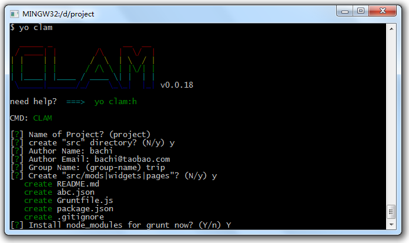

# KISSY 项目构建工具，Generator-clam

环境依赖：Node、Npm，视频演示：[http://ascii.io/a/4384](http://ascii.io/a/4384)。

## 安装 & 基本命令

首先安装[grunt](http://gruntjs.com) 和 [yeoman](http://yeoman.io/)：

	npm install yo grunt-cli -g

 安装Generator-Clam：

	npm install -g generator-clam generator-kissy-gallery

命令：

- `yo clam:h`:打印帮助
- `yo clam`:初始化Project
- `yo clam:mod`:初始化一个模块
- `yo clam:widget`:初始化一个标准kissy组件，首先创建组件空目录，进入空目录后执行此命令
- `yo clam:widget x.y`:生成一个标准kissy组件的版本，进入到组件目录后执行。其中x.y是版本号
- `yo clam:on`:启动web服务，服务支持SSI
- `yo clam:build`:构建一个Page，将引用到的JS/CSS静态合并，并输出结构化好的HTML

## Grunt 内嵌命令

初始化完成的项目包含Gruntfile.js模板，可以辅助你完成：

- `grunt`: 执行构建
- `grunt prepub`:执行预发
- `grunt publish`:执行发布
- `grunt info`:查看当前库git地址
- `grunt newbranch`:创建新daily分支，基于当前版本累加
- `grunt listen`:监听文件修改，实时编译

> ps:grunt构建任务依赖`grunt-mytps`子任务，该子任务（上传本地图片到CDN并替换地址）依赖python，并需要安装[tpsmate](https://github.com/sodabiscuit/tpsmate)。

## 再多了解一点`Generator-Clam`

> “会不会制造工具，是人和动物的根本区别。”——富兰克林（美）

### CLAM 工具族

`Clam`是 [陶清](http://weibo.com/u/1846621405) 对于前端模块化开的实践和落地项目，它是一个工具，旨在建立标准的模块开发流程，提高代码共享和项目构建效率，同时提供一个本地轻服务，让我们“可以坐在美丽的沙滩上写代码”。

`Clam`之后有两个衍生版本，`Clam-tools`和`Generator-Clam`。

1，[Clam](http://gitlab.alibaba-inc.com/clam/tree/master)

clam包含一套完整的模块化开发思想，用来规范结构化越来越强的前端页面，Clam创建之初还没有Grunt，Clam用Grunt的思路来提供脚手架，用来应对页面结构较为固定的开发场景。

2，[Clam-Tools](http://gitlab.alibaba-inc.com/jay.li/clam-tools/tree/master)

由于时间仓促，Clam没实现发布、自定义构建和对KISSY的解析，Clam-Tools弥补了这几个空缺，且提供了GUI工具，实现了基于Ant的一键式构建和发布，但前提是你的项目基于SVN发布。另外一个问题在于，实际上没几个前端玩的动Ant。

3，[Generator-Clam](http://github.com/jayli/generator-clam)

2013年淘系全面推广基于Gitlab的Assets发布，Grunt和Yeoman社区渐渐成熟，Generator-Clam与时俱进，延续了Clam模块化的思想，结合Yeoman和Grunt提供了面向淘系前端环境构建脚手架工具，包含前端开发/构建/发布的全流程。Generator-Clam 对代码单元做更自由的定义，根据适用范围，任何代码单元从三个维度管理：

- 项目（代码集合最大单位）
- 模块（业务功能单元，部分业务之间可共用）
- 组件（可全局共用）

最初Clam独立出了Page，Page本身也是一个模块，这里统一用模块来管理。

### Generator-Clam 的初衷和目标

Generator-Clam 初衷是面向KISSY和Gitlab用户构建一套前端开发脚手架，通过`yo clam`来将你引路到Grunt，帮助你更熟练的使用Grunt。

### 使用 Generator-Clam 应对这三种基本场景

1，创建新项目

`yo clam`构建新项目时会生成Gruntfile.js。之后你只需特别关注Gruntfile.js即可。

2，接手项目

如果你要接手一个项目，代码检出后即可进行调试；在运行`grunt`命令之前需要运行`npm install --link`。 

3，标准格式的KISSY组件

[KISSY标准组件](http://gallery.kissyui.com)的构建使用`yo kissy-gallery x.y`，已经被映射为`yo clam:widget`，KISSY标准组件是可以直接构建为可发布到淘宝CDN的代码，并提交至`kissy gallery`中。因此，你的项目中所有widgets都应当和KISSY标准组件格式保持一致，方便被其他项目使用。

### Demo的运行

Generator-clam 提供一个轻服务（只提供静态文件服务器、[Flex-Combo](http://npmjs.org/flex-combo) 和SSI支持），启动服务后你可以这样访问Demo：

	http://localhost:8888/src/pages/detail.html?ks-debug

> 这里的SSI兼容apache，但这个Server还是功能很弱，且不支持脚本，我们强烈建议您使用更成熟的[apache+php来作为本地demo服务](http://wiki.ued.taobao.net/doku.php?id=ued.bj:f2e:tbcdn)，Clam只作为构建工具使用。

### 预发和发布

为了限制在daily分支上发布，我们将grunt构建也加了限制，非daily分支上禁止构建，（你当然可以随意修改Gruntfile.js去掉限制），只有build目录中的文件会被发布，所发布的项目中build目录中的文件地址为，前缀自选

	http://a.tbcdn.cn/g/group-name/project-name/x.y.z/mods.js

对应到 g.tbcdn.cn 的地址：

	http://g.tbcdn.cn/group-name/project-name/x.y.z/mods.js

## Q & A

1，'yo clam'安装node模块的时候报错？

	npm ERR! Error: EACCES, mkdir '/usr/local/lib/node_modules/grunt-xx'

- 原因：没有sudo
- 解决办法：在当前目录执行`sudo npm install --link`

2，tpsmate安装完了还是不能把图片自动上传CDN?

- 原因：需要首先找到`node_modules`中手动执行一次
- 解决办法：进入`node_modules/grunt-mytps/tasks/lib/tpsmate/src`，执行`python ./cli.py upload`，这时提示你输入TMS用户名和密码，完成即可

3，tpsmate安装完成，但执行报错？

- 原因：依赖包不完整
- 解决办法：安装依赖`pip install -r node_modules/grunt-mytps/tasks/lib/tpsmate/src/requirements.txt`

## TODO

- include JS和CSS文件的提取合并
- JSON接口模拟和映射
- 构建时图片自动上传TPS
- JS2PHP的解析（这么蛋疼的功能需要吗？）

